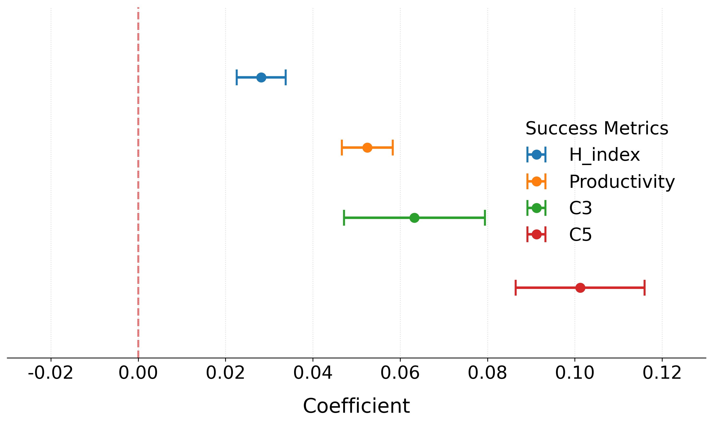
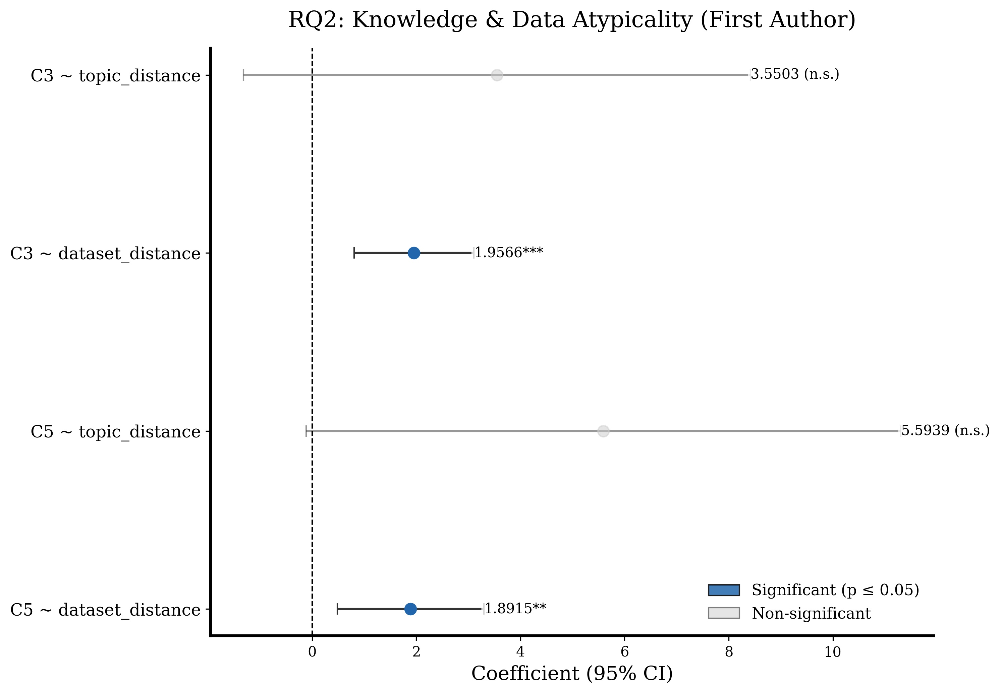
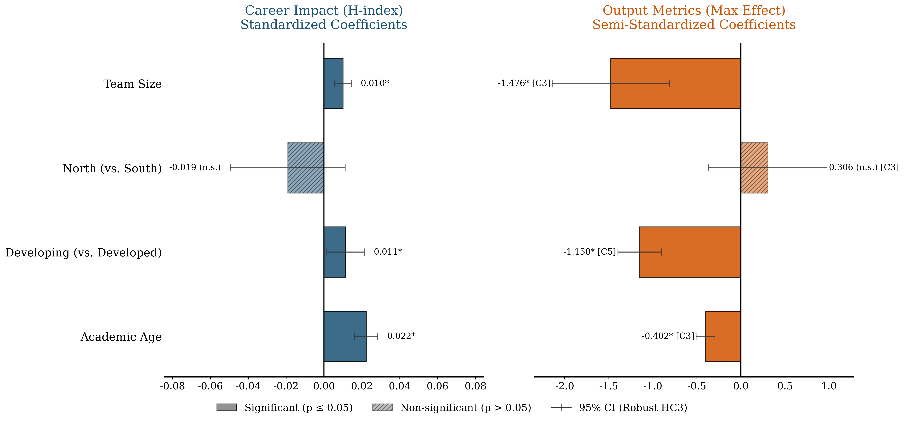
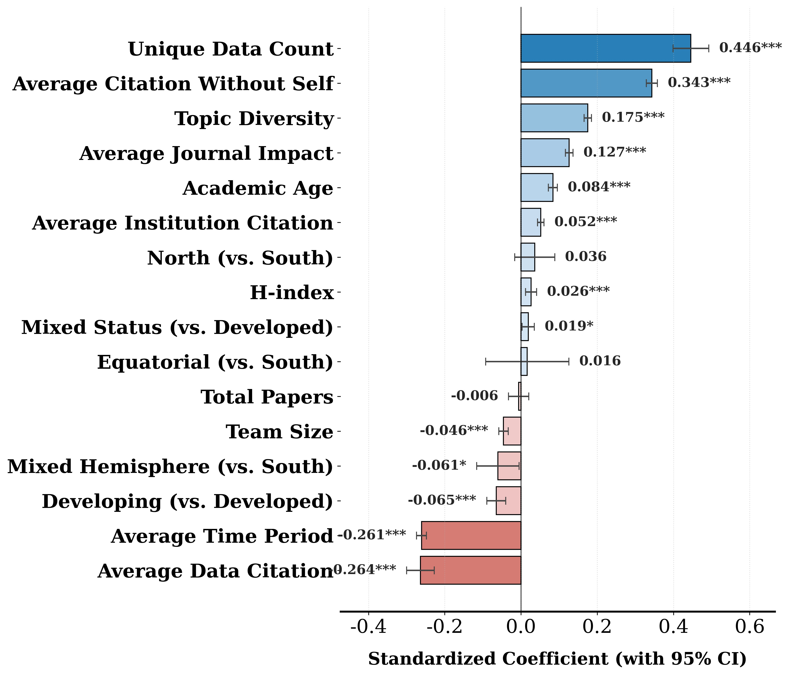
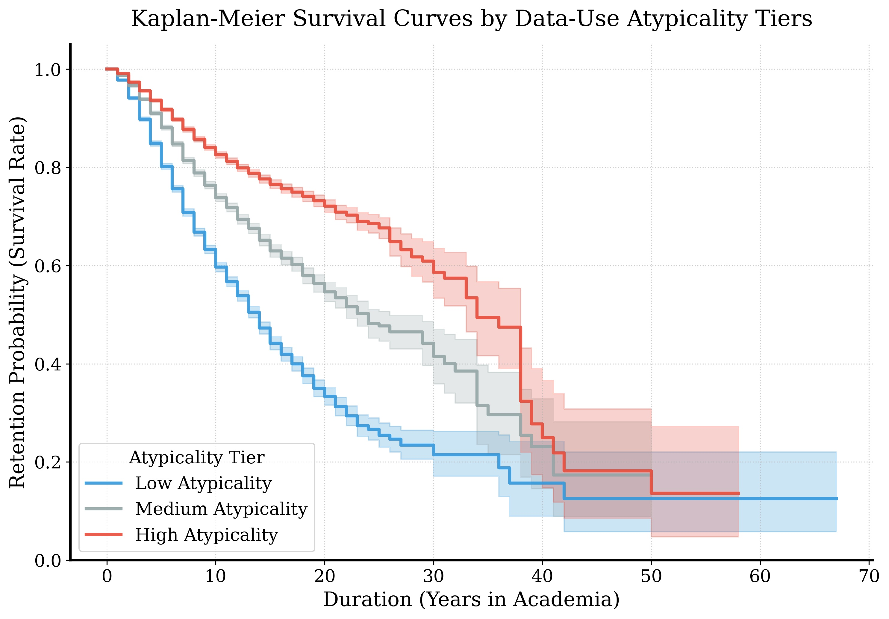
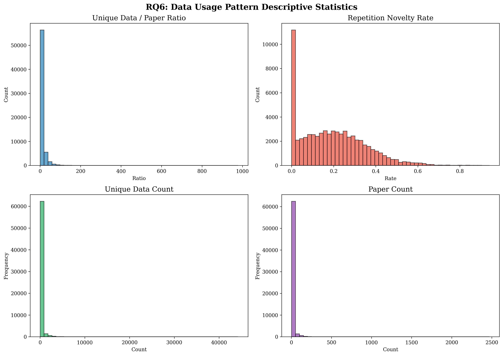

# Atypicality — 数据使用非典型性对学术成功的影响

## 项目概述

本项目研究数据使用的非典型性（Atypicality）如何影响学术成功，涵盖多个研究问题（Q1, RQ2-RQ6）。项目采用**三层架构**管理数据流转，确保大文件隔离、研究问题解耦、结果可复现。

## 数据流转架构

```
基础层（原始数据 → 中表，需 100G+ SciSciNet，本文档不涉及）
────────────────────────────────────────────────────────────
派生层  中表 + Q2共享表  ──→  process_data.py  ──→  小表（回归宽表）
分析层  小表  ──→  analysis.ipynb  ──→  回归结果 + 图表
```

核心中表 `authors_with_c3_c5_avg.csv`（~400M）存放在 `data/interim/`，是派生层和分析层的起点。

## 研究问题总览

| RQ | 研究问题 | 因变量 | 核心自变量 | 模型 |
|----|----------|--------|------------|------|
| **Q1** | 数据使用非典型性对学术成功的影响 | H_index, Productivity, C3, C5 | Atypicality | NB / OLS / GLM |
| **RQ2** | 知识与数据的双重跨界（Paper-Level） | C3, C5 | topic_distance, dataset_distance | OLS + NB |
| **RQ3** | 地理/发展水平调节效应 | Atypicality | H_index 等 | 分组 OLS + NB |
| **RQ4** | 数据使用非典型性的决定因素 | Atypicality | H_index, Academic_Age 等 | OLS |
| **RQ5** | 非典型性与学术生涯留存 | Academic Retention | Atypicality | Cox PH + KM |
| **RQ6** | 数据使用模式的 Embedding 分析 | — (描述性) | — | Word2Vec + 聚类 |

## 样例结果

以下为各研究问题的代表性图表（完整结果见 `studies/<RQ>/figures/`）。

| RQ1: 数据非典型性对学术成功的影响 | RQ2: 知识与数据双重跨界（一作） |
|:---:|:---:|
|  |  |

| RQ3: 地理/发展水平调节效应 | RQ4: 非典型性的决定因素 |
|:---:|:---:|
|  |  |

| RQ5: 非典型性与学术生涯留存 | RQ6: 数据使用模式描述性统计 |
|:---:|:---:|
|  |  |

## 目录结构

```
Atypicality/
├── configs/config.yaml              # 路径与参数统一配置
├── requirements.txt
├── data/
│   ├── raw/                         # 原始数据（NAS 挂载，不进 Git）
│   └── interim/                     # 中表 + 共享表（不进 Git）
│       ├── authors_with_c3_c5_avg.csv
│       ├── authors_info.csv
│       ├── paper_level_data_atypicality.csv
│       ├── papers_with_embeddings.csv
│       ├── Q2/                      # RQ 系列共享派生表 + Word2Vec 模型
│       └── modify/                  # RQ2 现成回归宽表
├── src/                             # 公共模块
│   ├── data_loader.py               # 统一数据读取
│   ├── big_data_processor.py        # Step 1-2: 原始数据 → authors_info
│   ├── feature_engineer.py          # Step 4: authors_info → 核心中表
│   ├── embedding.py                 # Step 3: OpenAlex API + Sentence Transformer
│   ├── regression.py                # 通用回归（NB, OLS, GLM, Cox PH）
│   └── visualization.py             # 通用可视化（forest, butterfly, KM 等）
├── scripts/
│   ├── build_interim_table.py       # Step 1-4 完整流程
│   └── validate_data.py             # 数据验证与统计摘要
└── studies/                         # 各研究问题独立目录
    └── <RQ>/
        ├── process_data.py          # 中表 → 小表
        ├── analysis.ipynb           # 小表 → 回归 + 图表
        ├── results/                 # 回归结果 CSV（自动生成）
        └── figures/                 # 图表 PDF（自动生成）
```

## 复现方案

提供两种复现路径，均**不需要从 SciSciNet 原始数据（100G+）开始**。根据手头已有的数据文件选择合适方案。

### 方案 A：只回归（直接从中表数据运行分析）

> **适用场景**：已有 `data/interim/` 下的中表和共享表，只需运行回归和出图。

**所需数据**

| 研究问题 | 所需数据文件 | 来源路径 |
|----------|-----------|---------|
| RQ1 | `authors_with_c3_c5_avg.csv` | `data/interim/` |
| RQ2 | `paper_level_regression_ready.csv`, `paper_level_first_author_ready.csv` | `data/interim/modify/` |
| RQ3 | `atypicality_authorlevel_withCountry.csv` | `data/interim/Q2/` |
| RQ4 | `atypicality_authorlevel_withCountry.csv` | `data/interim/Q2/` |
| RQ5 | `retention_authorlevel.csv` | `data/interim/Q2/` |
| RQ6 | `author_data_usage_stats.csv` + Word2Vec 模型 | `data/interim/Q2/` |

**输出位置**

| RQ | 回归结果 CSV | 图表 JPG |
|----|-------------|---------|
| RQ1 | `studies/RQ1/results/rq1_regression_results.csv` | `studies/RQ1/figures/rq1_forest_plot.jpg` |
| RQ2 | `studies/RQ2/results/rq2_all_author_results.csv`, `rq2_first_author_results.csv` | `studies/RQ2/figures/rq2_forest_all.jpg`, `rq2_forest_first_author.jpg` |
| RQ3 | `studies/RQ3/results/rq3_regression_results.csv` | `studies/RQ3/figures/rq3_butterfly.jpg` |
| RQ4 | `studies/RQ4/results/rq4_regression_results.csv` | `studies/RQ4/figures/rq4_gradient_bar.jpg` |
| RQ5 | `studies/RQ5/results/rq5_cox_results.csv` | `studies/RQ5/figures/rq5_km_curve.jpg` |
| RQ6 | `studies/RQ6/results/rq6_descriptive_stats.csv` | `studies/RQ6/figures/rq6_descriptive_stats.jpg`, `rq6_umap_projection.jpg` |

回归结果 CSV 包含字段：`label, x_var, coef, std_err, pvalue, ci_lower, ci_upper, r_squared, n_obs, converged`。

**步骤**

```bash
git clone <repo-url> Atypicality && cd Atypicality
pip install -r requirements.txt
# 将中表和共享表放入 data/interim/ 对应位置（见上表）

# 默认方案 A（从 data/interim/ 直接读取）
python studies/RQ1/analysis.py
python studies/RQ2/analysis.py
python studies/RQ3/analysis.py
python studies/RQ4/analysis.py
python studies/RQ5/analysis.py
python studies/RQ6/analysis.py

# 或显式指定方案 A
python studies/RQ1/analysis.py --plan A
```

**特点**：跳过所有 `process_data.py`，`analysis.py` 直接读取 `data/interim/` 中的现成数据，最快出结果；但无法修改特征工程逻辑。

---

### 方案 B：从中表计算特征后回归

> **适用场景**：希望修改特征工程逻辑（增减控制变量、调整缩尾/标准化参数），或需从头生成小表。

**两步流程**

```
process_data.py（派生层）          analysis.py --plan B（分析层）
  核心中表 ──→ 回归宽表      ──→    回归结果 + 图表
  (data/interim/)   (studies/<RQ>/)       (studies/<RQ>/results/ + figures/)
```

**所需数据**

| 文件 | 目标路径 | 被哪些 RQ 使用 | 大小 |
|------|---------|---------------|------|
| `authors_with_c3_c5_avg.csv` | `data/interim/` | Q1, RQ2, RQ3, RQ6 | ~400M |
| `authors_info.csv` | `data/interim/` | RQ6 | ~200M |
| `paper_level_data_atypicality.csv` | `data/interim/` | RQ2 | ~90M |
| `papers_with_embeddings.csv` | `data/interim/` | RQ2（备用） | ~100M |
| `paper_level_regression_ready.csv` | `data/interim/modify/` | RQ2（引用指标来源） | ~100M |
| `paper_level_first_author_ready.csv` | `data/interim/modify/` | RQ2（第一作者筛选） | ~100M |
| `atypicality_authorlevel_withCountry.csv` | `data/interim/Q2/` | RQ3, RQ4 | ~80M |
| `geographic_authorlevel_middle.csv` | `data/interim/Q2/` | RQ3 | ~30M |
| `topic_dataset_paperlevel_merged.csv` | `data/interim/Q2/` | RQ2 | ~160M |
| `retention_authorlevel.csv` | `data/interim/Q2/` | RQ5 | ~40M |
| `author_data_usage_stats.csv` | `data/interim/Q2/` | RQ6 | ~20M |
| `dataset_word2vec.model` + `.npy` | `data/interim/Q2/` | RQ6 | ~模型文件 |

**按需最小子集**

- **仅 Q1**：核心中表
- **仅 RQ2**：核心中表 + `paper_level_data_atypicality.csv` + `topic_dataset_paperlevel_merged.csv` + `paper_level_regression_ready.csv` + `paper_level_first_author_ready.csv`
- **仅 RQ3**：核心中表 + `geographic_authorlevel_middle.csv` + `atypicality_authorlevel_withCountry.csv`
- **仅 RQ4**：`atypicality_authorlevel_withCountry.csv`
- **仅 RQ5**：`retention_authorlevel.csv`
- **仅 RQ6**：`authors_info.csv` + 核心中表 + `author_data_usage_stats.csv` + Word2Vec 模型

**步骤**

```bash
git clone <repo-url> Atypicality && cd Atypicality
pip install -r requirements.txt
# 将中表和共享表放入 data/interim/ 对应位置（见上表）

# 第一步：生成各 RQ 回归宽表（可修改 process_data.py 中的特征工程逻辑）
python studies/RQ1/process_data.py    # → studies/RQ1/rq1_regression_ready.csv
python studies/RQ2/process_data.py    # → studies/RQ2/rq2_all_author_ready.csv
python studies/RQ3/process_data.py    # → studies/RQ3/rq3_regression_ready.csv
python studies/RQ4/process_data.py    # → studies/RQ4/rq4_regression_ready.csv
python studies/RQ5/process_data.py    # → studies/RQ5/rq5_regression_ready.csv
python studies/RQ6/process_data.py    # → studies/RQ6/rq6_analysis_ready.csv

# 第二步：使用方案 B 运行分析（从 studies/<RQ>/ 读取）
python studies/RQ1/analysis.py --plan B
python studies/RQ2/analysis.py --plan B
python studies/RQ3/analysis.py --plan B
python studies/RQ4/analysis.py --plan B
python studies/RQ5/analysis.py --plan B
python studies/RQ6/analysis.py --plan B
```

**`--plan` 参数说明**

所有 `analysis.py` 均支持 `--plan {A,B}` 参数：

| 参数 | 行为 | 数据来源 |
|------|------|----------|
| `--plan A`（默认） | 从 `data/interim/` 直接读取现成数据 | 各 RQ 的中间表 |
| `--plan B` | 从 `studies/<RQ>/` 读取 process_data 输出 | `process_data.py` 生成的小表 |

错误检测：
- 选择 `--plan B` 但对应文件不存在时，会提示"请先运行 `process_data.py`"
- 输入 `--plan C` 等无效值时，argparse 自动拦截

> **注意**：RQ2 的 `process_data.py` 需合并多个大文件（总计 ~500MB+），在内存 < 4GB 的环境中可能因 OOM 失败。建议在内存充足的机器上运行，或将大文件拆分为 chunk 加载。

**特点**：可自由修改 `process_data.py` 中的控制变量、缩尾阈值、标准化方式，重新运行即更新小表；需更多磁盘空间。

---

### 方案对比

| | 方案 A（只回归） | 方案 B（中表→小表→回归） |
|---|---|---|
| **命令示例** | `python studies/RQ1/analysis.py` | `python studies/RQ1/process_data.py && python studies/RQ1/analysis.py --plan B` |
| **所需数据** | 各 RQ 现成小表 | 核心中表 + Q2 共享表 |
| **磁盘占用** | ~几十 MB | ~1 GB+ |
| **可定制性** | 无法修改特征工程 | 可自由调整 |
| **适合场景** | 快速验证结果、出图 | 修改研究设计、敏感性分析 |

## 代码架构

### `src/data_loader.py` — 统一数据读取

替代 Colab 中的 `drive.mount` + `pd.read_csv` 模式：

```python
from src.data_loader import load_config, load_core_table, load_q2_table

config = load_config()
df = load_core_table(config)                    # 核心中表
q2_df = load_q2_table(config, "filename.csv")   # Q2 共享表
```

### `src/regression.py` — 通用回归工具

自动处理缺失值、缩尾、标准化，结果可持久化：

```python
from src.regression import run_ols, run_nb, run_cox_ph, save_results

result = run_ols(df, y_var="C3", x_var="Atypicality", controls=["H_index", "Academic_Age"])
result = run_nb(df, y_var="H_index", x_var="Atypicality", controls=[...])
result = run_cox_ph(df, duration_var="Duration", event_var="Event", x_var="Atypicality", controls=[...])

save_results(results_dict, "studies/Q1/results/q1_regression_results.csv")
```

### `src/visualization.py` — 通用可视化

字体/颜色/尺寸从 `config.yaml` 读取：

```python
from src.visualization import plot_forest_chart, plot_km_curve, save_fig

fig = plot_forest_chart(results_dict, title="Regression Results")
save_fig(fig, "studies/Q1/figures/forest_plot.pdf")
```

## 新增研究问题

1. 在 `studies/` 下创建新目录，如 `RQ7/`
2. 创建 `process_data.py`：从中表计算特征，生成回归宽表
3. 创建 `analysis.ipynb`：调用 `src/regression.py` 和 `src/visualization.py` 完成分析
4. 如需新的共享数据，放入 `data/interim/` 并在 `config.yaml` 中添加路径

## 注意事项

- **所有数据文件（csv/tsv/parquet/db/pkl/npy/model）已被 .gitignore 忽略**，不会进入 Git
- **路径不硬编码**：统一在 `configs/config.yaml` 中配置
- **小表由 `process_data.py` 动态生成**，无需手动放置
- **Colab 工作痕迹**保留在 `colab/` 目录中（已被 .gitignore 忽略），仅供参考